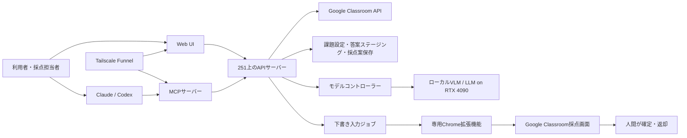

# Google Classroom 採点支援システム 技術・運用引継ぎ資料

最終更新: 2026-07-25  
対象プロジェクト: `/home/kake/classroom-grading-automation`（192.168.112.251）

> この資料は、ChatGPT Pro、Claude、Codex、開発協力者、教員へ現状を共有し、今後の設計方針を議論するためのものです。学生名、メールアドレス、答案本文、OAuthトークン、秘密鍵などは記載していません。

## 1. システムの目的

Google Classroomの採点業務を、教員以外の採点担当者でも容易に扱える形で支援することが目的である。

重視している要件は次のとおり。

- Web UI上でGoogleアカウントへログインするだけでClassroomと連携できる
- 利用者がGoogle APIキー、OAuth認証JSON、Web UI専用APIトークンを個別に準備しなくてよい
- 課題一覧・課題内容・答案・採点基準をWeb UIまたはMCPから取得できる
- ローカルLLM、Claude、Codexなど複数の採点手段を選べる
- AIは点数とコメントを「下書き」として入力し、最終確定・返却は人が行う
- SSHやVPNを使わず、外部から固定HTTPS URLで利用できる
- ローカルモデル採点時は学生データとGPU推論を高性能サーバー251内に置く
- 採点の根拠、基準との整合性、図表の見落としを確認できる
- 人間がすでに確定した点数を上書きしない

本システムは「完全自動で成績を確定・返却するシステム」ではない。AIが採点案と根拠を作成し、Classroomへ下書き入力するところまでを自動化し、人間がClassroom上で最終判断する設計である。

Claude/CodexをMCP採点者として使う場合、採点に必要な答案内容は各事業者のモデルへ送信される。したがって「学生データを研究室内に閉じる」という性質はローカルモデル採点に限られ、外部AI利用時は所属組織の情報管理方針と契約条件の確認が必要である。

## 2. 現在の基本方針

### 2.1 すべて下書き

課題種別にかかわらず、AIの結果はすべて下書きとして扱う。

- 感想文も演習も同じ扱い
- AIが確定点を直接公開しない
- AIが答案を学生へ返却しない
- 人間の確定済み点数は保護する
- 最終確認はClassroomの標準画面で行う

過去には「感想文は全下書き、演習は確定のみ入力」という旧方針があったが、現在は廃止する方向で統一している。

### 2.2 Web UIを操作の中心にする

一般利用者がSSHコマンドやサーバー上の設定ファイルを操作しなくても利用できることを目標にしている。

現在の公開URL:

`https://classroom-grader-1.tail80e540.ts.net/ui/`

公開にはTailscale Funnelを使用している。独自ドメイン、VPN、SSHポートフォワードを利用者へ要求しない。現時点では「クラウド上の小さなゲートウェイ＋251のローカル採点エージェント」方式ではなく、251上のWeb UIをFunnelで直接HTTPS公開している。

### 2.3 人とAIの責任分界

| 処理 | AI・システム | 人間 |
|---|---:|---:|
| 課題・答案取得 | 実行可能 | 確認可能 |
| 採点基準作成 | 提案・構造化可能 | 最終決定 |
| 点数・理由・根拠の生成 | 実行可能 | 修正可能 |
| Classroomへの点数の下書き入力 | 実行可能 | 確認可能 |
| 点数の確定 | 実行しない | 実施 |
| 返却・公開 | 原則実行しない | 実施 |

## 3. 全体アーキテクチャ



### 3.1 251サーバー

主な実行環境:

- ホスト: `192.168.112.251`
- プロジェクト: `/home/kake/classroom-grading-automation`
- GPU: NVIDIA GeForce RTX 4090 24GB
- CPU: Core i9級
- Docker ComposeでWeb API、採点コマンド、モデルコントローラー等を運用
- vLLMのOpenAI互換APIをローカル推論に使用

### 3.2 主要コンポーネント

- Web API / Web UI
- Google OAuth・セッション管理
- Classroom API連携
- 課題設定・採点基準管理
- 答案取得・PDFレンダリング・OCR/テキスト抽出
- ローカルモデル採点
- 外部AI向けMCP
- Chrome拡張機能
- 下書き入力ジョブ
- 集計・ランキング・Google Sheets出力
- モデルコントローラー
- 監査ログ・バックアップ

### 3.3 実装状況の要約

| 領域 | 状態 | 補足 |
|---|---|---|
| GoogleログインとClassroom OAuth | 実装済み | 利用者ごとの担当コースを取得。Web UI専用token入力は不要 |
| コース・課題一覧 | 実装済み | 多数課題時の読み込み速度は改善余地あり |
| 採点基準・0〜3→実点換算 | 実装済み | fingerprintで採点案との整合を管理 |
| 採点基準テンプレート複数管理 | 実装済み | 作成・適用・名称変更・削除 |
| 答案取得・ステージング | 実装済み | PDF/文書の画像・テキストを採点用に準備 |
| ローカルモデル採点 | 実装済み | Qwen2.5/Qwen3/MiniCPMを切替可能。標準はQwen2.5単独（第9節） |
| Web UI一括採点 | 実装済み | `run→refine→report`とモデル切替をジョブ化 |
| Claude/Codex MCP採点 | 実装済み | 最大30件packet・batch保存に対応 |
| MCP課題下書き作成・公開 | 実装済み | preview、明示確認、冪等性、所有者制限あり |
| MCP作成課題へのAPI下書き点入力 | 実装済み | 空欄のみ。確定・返却・上書きはしない |
| UI作成課題への拡張入力 | 実装済み | MV3 v0.5.4。Classroom DOM依存のE2E安定化が課題 |
| 点数コメントのClassroom入力 | 未実装 | 現在の拡張は点数だけを扱う |
| ランキング・Sheets出力 | 実装済み | 確定済み点だけを集計。Sheets追加scopeが必要 |
| ロール・組織向け管理 | 最小限 | 現在は限定共有前提。一般公開前に強化が必要 |
| クラウドゲートウェイ方式 | 未実装 | 現在は251をTailscale Funnelで直接公開 |

「実装済み」はコードとテストが存在するという意味であり、非技術者による長期の実運用が完了したことを意味しない。とくに拡張入力、課題公開、Sheets出力はテスト用コースでのE2E確認を重ねる必要がある。

## 4. Google認証とアカウント分離

### 4.1 Web UIからのGoogleログイン

利用者はWeb UIでGoogleアカウントへログインする。OAuth認可によりClassroom APIへアクセスするため、利用者が次を準備する必要はない。

- Classroom APIキー
- 個人用のOAuthクライアントJSON
- サーバーへ手動配置するtoken.json
- Web UI独自のAPIトークン

GoogleログインをWeb UIのログイン認証にも統合している。認証トークンは利用者ごとに保存され、同一ブラウザではセッション・OAuthトークンを再利用できる。Google側の失効、権限取消、サーバー側セッション期限などが発生した場合は再ログインが必要になる。

### 4.2 コース自動取得

固定course_idを前提にせず、ログインした利用者が教師として参加しているコースを自動取得し、Web UIで選択できる。

過去に別の利用者がログインした際、固定course_idの課題取得で404になった。この問題を受け、利用者ごとの担当コースを列挙する方式へ変更した。

### 4.3 アカウント分離

OAuthトークン、MCPの所有者参照、採点案、ジョブは利用者単位で分離する設計である。MCP接続済みでも、別ブラウザのWeb UIセッションが自動的にログイン済みになるとは限らない。MCP認証とブラウザセッション、Google OAuthはそれぞれ境界が異なる。

### 4.4 現在の簡略化

リンクを渡す相手を限定する運用のため、管理者・教員・採点者などの詳細なロール管理は現時点で優先していない。ただし公開範囲を拡大する場合は必須になる。

## 5. 課題・採点基準管理

### 5.1 課題一覧

担当コースを選ぶと、課題一覧、期限、満点、答案件数、採点済み件数、準備状況を取得できる。

課題一覧の読み込みが遅くなる原因として、各課題の設定・準備状況を順番に取得していた点がある。並列化・キャッシュが改善課題として残る。

### 5.2 採点基準

課題ごとに次を保存できる。

- 採点基準
- 教師備考
- 0〜3の内部評価
- Classroom上の実点への対応表
- 減点条件・境界条件
- 採点プロンプトに渡す補足

例:

| 内部点 | 実点 |
|---:|---:|
| 0 | 0 |
| 1 | 8 |
| 2 | 9 |
| 3 | 10 |

課題の満点が異なる場合も、内部0〜3点を課題ごとの実点へマッピングする。単なる線形正規化ではなく、「普通に書けていれば8点」のような教師の意図を明示できる。

複数の採点基準テンプレートをコース単位で作成・適用・名称変更・削除するWeb UIを実装済み。テンプレート適用時は課題の満点へ換算し、未確認状態のフォームとして反映する。

### 5.3 Claude/Codexとの会話による基準登録

MCPの採点方針更新機能により、Claude/Codexへ自然文で基準を伝え、構造化してWeb UI側へ保存できる。

代表的な意図:

```text
ソニーの課題を採点して。
0→0点: 未提出と同レベル
1→8点: 講義の感想が普通に書けている
2→9点: 8点より内容が良い
3→10点: 特に優れたレポート
```

採点開始前に基準のfingerprintを確認し、途中で基準が変わった結果を混在させない。

## 6. 答案準備

Classroomから答案を取得し、251上で採点用にステージングする。

主な処理:

- 提出一覧取得
- 人間の確定点の保護判定
- 添付ファイル取得
- PDF・文書レンダリング
- ページ画像生成
- OCR・テキスト抽出
- テキストのみで処理可能か、画像確認が必要かの分類
- 匿名item_idの生成

画像を完全に捨てる方式は採らない。テキストを主入力にして高速化しつつ、図表・数式・レイアウト依存答案は画像を併用する。

## 7. ローカルモデル採点

### 7.1 導入済みモデル

| プロファイル | モデル | 用途 | 形式 |
|---|---|---|---|
| `q25-7b` | Qwen2.5-VL-7B-Instruct | 高速一次採点 | BF16系 |
| `q3-8b` | Qwen3-VL-8B-Instruct-FP8 | 高精度採点・審判 | FP8 |
| `minicpm-v45` | MiniCPM-V-4.5 | 比較・第三モデル | BF16 |

MiniCPM-V-4.5導入では次を変更した。

- `scripts/vllm-server.sh`
- `scripts/model-controller.py`
- `grader/benchmark_2x2.py`
- `grader/__main__.py`
- 関連テスト

MiniCPM設定:

- vLLM v0.11.0
- `--trust-remote-code`
- `--max-model-len 16384`
- `--gpu-memory-utilization 0.85`
- `--max-num-seqs 4`
- 1プロンプト画像上限10
- BF16（量子化なし）

ダウンロード時にXet・hf_transferが例外を起こしたため、次を設定して通常HTTPレンジ取得へ固定し、約10.7MB/sで安定取得した。

```text
HF_HUB_DISABLE_XET=1
HF_HUB_ENABLE_HF_TRANSFER=0
```

### 7.2 採点出力

モデルは答案ごとに原則として次を返す。

- `internal_score`: 0〜3
- `reason`: 判定理由
- `evidence`: 答案中の短い根拠
- `rubric_level`: 対応する基準レベル
- `confidence`: 確信度

### 7.3 バッチ処理

テキスト答案は複数件をまとめて1リクエストにする。JSON形式不整合がある場合はバッチを二分して再試行する。

画像答案の扱いは経路によって異なる。**本番の`hybrid_grade.grade_visual`は1答案＝1リクエスト**であり、複数答案をまとめない。ベンチマーク経路の`benchmark_2x2._visual_batches`は最大3答案・10画像までまとめるため、両者のリクエスト数は同一課題でも数倍異なる。過去の速度比較を読む際は、どちらの経路の測定かを確認する必要がある（第9.3節）。

過去にClaude MCP採点で1件ずつ取得・保存した際は、49件で10分以上、Claude Sonnetの利用枠を30〜40%程度消費した。現在は`get_grading_work_packet(limit=30)`でテキスト答案を優先して最大30件取得し、`submit_grading_proposals_batch`で最大30件を全件検証後に一括保存できる。画像付きpacketはbase64合計2MiBを上限とし、超過する答案は単件・ページ単位取得へフォールバックする。

### 7.4 根拠照合

現在評価している項目:

- 根拠が答案中に実在するか
- 点数と採点基準が整合するか
- 図表を見落としていないか
- 隣接レベルとの境界答案か
- `internal_score`と`rubric_level`が一致するか

自己検証だけでは誤検知があるため、正規化・文字列照合と、疑わしい答案の独立目視確認を組み合わせた。

## 8. 最新3モデル比較

対象は6課題。3モデルとも「単独採点1回＋根拠照合1回」で実施し、`no_grade_writes: true`を確認した。

対象課題:

- 機械学習の応用先
- 距離計算
- k-NN
- SVM
- 7月6日の「課題」
- ソニー特別講義

### 8.1 集計

| 指標 | Qwen2.5-VL-7B | Qwen3-VL-8B-FP8 | MiniCPM-V-4.5 BF16 |
|---|---:|---:|---:|
| 採点＋照合時間 | 約14.0分 | 約21.3分 | 約28.1分 |
| 点数完全一致率 | 41.3% | 53.8% | 59.4% |
| ±1点以内率 | 95.9% | 97.2% | 97.4% |
| 平均誤差 | +0.142 | +0.018 | -0.026 |
| 境界答案フラグ率 | 34.6% | 30.0% | 48.7% |
| 根拠不存在 | 14件（3.6%） | 3件（0.8%） | 8件（2.1%） |
| 基準不整合 | 46件（11.9%） | 5件（1.3%） | 8件（2.1%） |
| 図表見落とし | 28件（7.2%） | 8件（2.1%） | 8件（2.1%） |
| 推論エラー | 0 | 0 | 0 |
| score/rubric内部不整合 | 0% | 1.6%（6件） | 16.8%（64/382件） |

注意事項:

- Qwen2.5とQwen3は387件、MiniCPMは382件が集計対象である。公平な最終比較には3モデル共通の382件だけで再集計する必要がある。
- 参照点は完全に同質ではない。過去4課題は人間の確定点、7月6日課題には人間点と既存AI下書きが混在し、ソニーは既存Claude採点案との比較である。
- 「一致率」は絶対的な正解率ではなく、既存点との一致度である。
- 図表照合の一部は画像閲覧ツール障害によりOCRベースで代替した。

### 8.2 32件の独立サンプル確認

Qwen2.5:

- 「根拠不存在」5件を確認したが、5件とも答案中にほぼ同文が存在した
- 自己検証が過敏で、根拠不存在の誤検知が多い
- 基準不整合の指摘は概ね妥当または境界的

Qwen3:

- 根拠不存在3件中1件は明確な誤検知
- 1件は別課題の内容を提出した答案を正しく検出
- 基準不整合の指摘は概ね妥当
- 3モデル中、自己検証の信頼性が最も高い

MiniCPM:

- 根拠不存在5件中4件は誤検知
- k-NNで、実際には実験結果やkd-tree説明があるのに「取り組みが記載されていない」と定型的に誤判定する傾向
- `internal_score`と`rubric_level`の不一致が64件あり、構造出力の信頼性に問題

### 8.3 過去の多段採点との関係

過去には次の方式を試した。

1. Qwen2.5で一次採点
2. Qwen3で独立二次採点
3. 不一致・低確信答案だけQwen3で審判

この方式は課題ごとに約46〜70分かかり、Qwen3単独より一致率が安定して高くなるとは限らなかった。したがって「全答案を常に2モデルへ通す」方式を標準とする根拠は弱い。

## 9. モデル運用方針（2026-07-25 実測にもとづく現状）

### 9.0 現在の運用モード

| モード | 位置づけ | 既定 |
|---|---|---|
| Qwen2.5単独＋全件人間確認 | **標準**（高速下書き器） | 有効 |
| Qwen3単独 | **品質優先の非同期バッチ**（精度最良・現行構成では大幅に低速） | 手動選択 |
| Qwen3による答案単位の再確認 | 診断・実験用（通常UIでは目立たせない） | 手動 |
| Qwen2.5＋自動選択的Qwen3（適応型） | **実験**（精度悪化とルーティング性能不足のため） | 無効 |

標準モードをコード側で不可逆に固定してはいない。`config.yaml`の`vllm.model`はQwen2.5、`pairwise.model`はQwen3のままである。

Qwen3のUI上の位置づけ: 画像リクエストの平均レイテンシが約184秒である以上、答案行ごとの「Qwen3で再確認」ボタンを通常操作として見せると、利用者が対話的に数秒で返ると誤認する。当面は非同期バッチ（処理完了を待たず他の作業を継続できる形）として扱い、答案単位の再確認は診断用に留める。

### 9.1a 人間確認の優先順位：画像答案の最高点提案

Qwen2.5の画像答案バイアスは、人間確認の順序最適化に利用できる。画像答案92件での実測:

実件数（丸め値からの推定ではなく生データで確認）:

| 項目 | テキスト中心 | 図表中心 | 合算 |
|---|---:|---:|---:|
| 画像答案 総数 | 31 | 61 | 92 |
| Qwen2.5 完全一致 | 9 | 24 | 33 |
| Qwen2.5 点数不一致 | 22 | 37 | **59** |
| フラグ（Qwen2.5=最高点） | 20 | 51 | 71 |
| 人間点が最高点未満 | 29 | 43 | 72 |
| フラグかつ過大評価 | 18 | 35 | **53** |

3つの指標は分母が異なるため、名称を固定して使う。

| 指標名 | 定義 | 合算値 |
|---|---|---:|
| **画像最高点提案の過大評価率** | 53/71（フラグのうち人間点が最高点未満） | **74.6%** |
| **人間が最高点未満だった画像答案の捕捉率** | 53/72 | **73.6%** |
| **Qwen2.5点数不一致の捕捉率** | 53/59 | **89.8%** |

内訳検算: フラグあり×不一致 53件 ＋ フラグなし×不一致 6件 ＝ 不一致 59件。フラグあり×一致は18件。つまりQwen2.5が画像答案で点数を外した59件のうち53件（89.8%）がこのフラグに入り、見落としは6件である。

テキスト答案では過大評価率が0.14しかない（最高点提案21件中3件のみ過大）。したがってこのシグナルは**画像答案限定の複合条件**とする。

**このシグナルと既存自動ルータの適合率を直接比較しないこと。** 予測対象が異なる（本シグナルは「人間点が最高点未満か」、自動ルータは「Qwen3へ送れば改善するか」）。

Web UIでは`q25_visual_max_score`として次の条件で実装した。

- 一次モデルがQwen2.5（`primary_result.model`で判定）
- `has_visual_material` = true
- **`primary_result.internal_score`**が採点基準の最高レベル（内部3点）
- 人間未確認（`teacher_status != "confirmed"`）

判定は必ず一次採点結果（`primary_result`）から行う。統合後の最終点（`content_score`）や`review_result`はreview_wins適用後の値であり、Qwen2.5のバイアス検出には使えない。`primary_result`を持たない行（旧systemパイプライン等）ではフラグを立てない。

教員確認時には監査用に次を保存する（`TeacherReviewStore.save`）。点数の自動補正・ルーティングには使用しない。

```text
ai_proposal_score        AI提案点
score_changed            教員が点数を変更したか
score_delta              変更幅
signals_at_review        確認時に表示されていた注意シグナル（q25_visual_max_score等）
review_started_at        その答案行をアクティブ化した時刻
review_completed_at      確認を保存した時刻
review_duration_seconds  上記の差（Web UI上のactive時間）
```

#### `review_duration_seconds`の意味と限界

**`review_duration_seconds`はWeb UI上でその答案行がアクティブだった時間であり、Classroomを含む全確認時間ではない。**

- 計測開始は、一覧の描画時ではなく**教員がその行をアクティブ化した時点**（点数欄へフォーカス、または行をクリック）である。一覧描画時に全行へ一括設定すると「一覧を開いてからの経過時間」になり実際の確認時間にならないため、この方式へ修正した。
- 同時に進行するタイマーは常に1件だけである。別の行をアクティブ化すると直前の行の計測は破棄される。
- 次に含まれない: Classroom画面で答案PDFを読んだ時間、Classroom上での確定・返却操作、ブラウザを離れていた時間、Web UIを開く前の準備時間。
- 異常値（未来時刻、8時間超）は所要時間として採用しない。

したがって実測時は**wall-clock時間とWeb UI active時間を分けて報告する**。次回の実課題評価では、全件確認の開始・終了時刻を別途記録し、次の2つを併記する。

| 指標 | 取得元 |
|---|---|
| wall-clock全確認時間 | 全件確認の開始・終了時刻（別途記録） |
| Web UI active時間の合計 | `review_duration_seconds`の合計 |

両者の差はClassroom上での作業時間・中断時間を含むため、AI採点時間との比較には**wall-clock時間**を使う。`review_duration_seconds`は答案ごとの相対的な負荷（どのシグナルの答案に時間がかかるか）の分析に使う。

用途は次に限定する。

- 人間確認時の表示順を上げる（重み20。`low_confidence`=12より高く、独立検証失敗=25以上より低い中程度）
- 「画像答案の最高点提案（過大評価傾向あり・優先確認）」バッジを表示
- 課題上部に対象件数と確認指針を表示

次には**影響させない**。

- 自動下書き適格性（`automatic_eligible`）
- `proposal_state`
- Qwen3への自動ルーティング
- 点数の自動減点

`has_visual_material`単独は引き続き情報バッジのままである（画像が存在するだけでは問題ではない）。

### 9.1 過去結果の取り扱い（現在の判断には使用しない）

次の2点は**測定経路が異なる過去結果**であり、現在の標準判断の根拠にしてはならない。

- 「Qwen3はQwen2.5より約1.5倍遅い」: `benchmark_evidence_verify`経路の測定値。この経路は画像答案を`_visual_batches`で最大3件・10画像までまとめて1リクエストにしていた。
- 「適応型が速度と信頼性の均衡で有力」: ルーティング品質を実測する前の見込みであり、後述のとおり実測では精度が悪化した。

### 9.2 実測結果（2026-07-25、書き込みなし）

対象は2課題。参照点は`human_assigned`（`assignedGrade`のみ、下書き点へのフォールバックなし）。採点基準は課題固有の実基準（`rubric.py`のASSIGNMENT_*/RUBRIC_*、`policy_source=legacy_assignment`）。

精度（完全一致率）:

| 課題 | Qwen2.5単独 | 適応型(全件) | Qwen3単独 |
|---|---:|---:|---:|
| テキスト中心（n=68, visual 46%） | 50.0% | 47.1% | **67.7%** |
| 図表中心（n=67, visual 91%） | 44.8% | 41.8% | **68.7%** |

#### 精度差の所在：答案種別で分けると画像答案に集中している

2課題135件を答案種別で合算した結果:

| 答案種別 | n | Qwen2.5 | Qwen3 | 差 |
|---|---:|---:|---:|---:|
| テキスト答案 | 43 | 72.1% | 74.4% | +2.3pt |
| 画像答案 | 92 | 35.9% | 65.2% | **+29.3pt** |

平均符号付き誤差（画像答案、加重平均）:

- Qwen2.5: 約 **+0.55**（高得点方向の明確な正バイアス）
- Qwen3: 約 **-0.11**（ほぼ無偏、わずかに過小評価側）

したがって「Qwen3は全般的に推論能力が高い」ではなく、「**現在の2課題では、Qwen3の精度優位は主として画像答案で観測された。テキスト答案では差が小さい**」と記録するのが正確である。

課題単位の内訳:

| 課題 | 種別 | n | Qwen2.5 一致率(バイアス) | Qwen3 一致率(バイアス) |
|---|---|---:|---:|---:|
| テキスト中心 | テキスト | 37 | 67.6% (-0.11) | 78.4% (-0.08) |
| テキスト中心 | 画像 | 31 | 29.0% (+0.58) | 54.8% (-0.10) |
| 図表中心 | テキスト | 6 | 100% (0.00) | 50.0% (+0.50) |
| 図表中心 | 画像 | 61 | 39.3% (+0.54) | 70.5% (-0.12) |

図表中心課題では、人間が3点を付けたのは18件だが、Qwen2.5は51件を3点と提案した（過大35件／過小2件）。Qwen3は19件で人間の分布とほぼ一致する。

#### 定数シフトによる較正では説明できない

Qwen2.5へ-1点の定数シフトを与えた場合の回復量:

| 課題 | 指標 | 補正前 | -1点補正後 | Qwen3 | 回復率 |
|---|---|---:|---:|---:|---:|
| 図表中心 | 完全一致 | 44.8% | 52.2% | 68.7% | **31%** |
| 図表中心 | MAE | 0.552 | 0.507 | 0.328 | 20% |
| テキスト中心 | 完全一致 | 50.0% | 39.7% | 67.7% | **悪化** |
| テキスト中心 | MAE | 0.500 | 0.735 | 0.353 | 悪化 |

図表中心課題の完全一致率差23.9ポイントのうち、-1点補正で回復したのは7.4ポイント（約**31%**）にとどまる。残り約7割は定数シフトでは解消できない。テキスト中心課題では同じ補正が両指標を悪化させる。

したがって**画像答案を自動的に-1点する処理は入れない**。改善後でもQwen3との差が大きく、正しい最高点答案を下げる副作用があるためである。

#### 制約

結果は2課題に基づく。画像答案一般への恒久的な自動補正には使用しない。画像最高点提案の警告は、人間確認順の最適化にのみ利用する。

推論時間とend-to-end時間（通常状態＝Qwen2.5ロード済み）:

| 方式 | 推論のみ（テキスト中心／図表中心） | end-to-end（切替込み） |
|---|---|---|
| Qwen2.5単独 | 77.9秒 / 92.6秒 | 77.9秒 / 92.6秒 |
| 適応型 | 536.8秒 / 201.6秒 | 約680秒 / 約345秒 |
| Qwen3単独 | 2444.7秒 / 1714.3秒 | 約2588秒 / 約1858秒 |

end-to-endはQwen3への切替71.6秒（実測）とQwen2.5への復帰切替を含む。

### 9.3 Qwen3の速度に関する注意（2026-07-25 プロファイル）

同一サンプル（画像6件・テキスト6件、画像平均2.5ページ、`no_grade_writes`）での実測。

測定条件:

- Qwen2.5-VL-7B-Instruct BF16（`q25-7b`）
- Qwen3-VL-8B-Instruct-FP8（`q3-8b`）
- vLLM v0.11.0、`--max-num-seqs 4`、クライアント並列上限4
- 同一プロンプト（課題固有の実基準）・同一出力スキーマ・同一リクエスト構成

| 項目 | Qwen2.5 BF16 | Qwen3 FP8 | 比 |
|---|---:|---:|---:|
| 画像リクエスト数 | 6 | 6 | 1.0倍 |
| 画像 平均レイテンシ | 9.42秒 | 183.8秒 | 19.5倍 |
| 画像 中央値 / 最大 | 9.73 / 11.41秒 | 183.5 / 252.6秒 | — |
| 画像 prompt tokens平均 | 4,309 | 4,569 | 1.06倍 |
| 画像 completion tokens平均 | 139 | 349 | 2.5倍 |
| 同時処理数（上限/観測） | 4 / 7 | 4 / 7 | 同一 |
| 再試行 / エラー | 0 / 0 | 0 / 0 | 同一 |

**確定したこと**: リクエスト数・入力トークン数・同時処理条件・再試行数はいずれも同一であり、速度差は1リクエスト内の処理時間に由来する。出力長2.5倍だけでは全差を説明できない。

**スループット値の区別（混同しないこと）**:

| 値 | 条件 | 内容 |
|---|---|---|
| Qwen2.5 約15 tok/s 対 Qwen3 約1.9 tok/s | 並列実行（上限4・観測7）での総レイテンシから算出 | **実効値**。並列待ちとTTFTを含む |
| Qwen2.5 58.8 tok/s 対 Qwen3 10.4 tok/s | 逐次実行・長出力時のTPOTの逆数 | **decode値**。並列待ちとTTFTを除いた1トークンあたり |

前者は運用時の体感速度、後者はdecode性能の指標である。同じ比率として扱ってはならない。

**否定された仮説**: 「画像答案を1件ずつ処理していることが速度差の主因」。`grade_visual`が1答案＝1リクエストである事実は変わらないが、両モデルで同条件なので速度差の説明にはならない。バッチ化してもQwen3の遅さは解消しない見込みである。

記載上の注意: 「Qwen3はモデル自体が常に19.5倍遅い」と断定しない。言えるのは「**現在のモデル・vLLM・FP8・grade_visual構成において、画像リクエストの平均レイテンシが約19.5倍**」までである。

### 9.3a TTFT/TPOT分離プロファイル（原因はdecode、prefillではない）

ストリーミング応答で「リクエスト開始→最初のトークン」(TTFT)と「以降1トークンあたり」(TPOT)を分離した。逐次実行（並列にせずレイテンシを混ぜない）、画像6件・テキスト6件。

画像答案（フルスキーマ、`max_tokens=476`）:

| 指標 | Qwen2.5 BF16 | Qwen3 FP8 | 比 |
|---|---:|---:|---:|
| 総レイテンシ 平均 | 3.875秒 | 34.833秒 | 9.0倍 |
| **TTFT 平均** | 1.434秒 | 1.796秒 | **1.25倍** |
| TTFT が総時間に占める割合 | 31.0% | 5.4% | — |
| **TPOT 平均** | 17.0 ms/token | 95.9 ms/token | **5.6倍** |
| completion tokens 平均 | 144.3 | 337.2 | 2.3倍 |

**確定: prefill・画像前処理・Vision Encoderは原因ではない。** TTFTはほぼ同等（1.43秒 対 1.80秒）である。差はすべてdecode側にあり、TPOT 5.6倍 × 出力長2.3倍 ≈ 総時間9倍として説明できる。

#### 長出力条件で遅いdecode領域に入ることを確認した（機構は未特定）

Qwen3 FP8での2×2切り分け（画像答案）:

| 条件 | 実際の出力tokens | TPOT |
|---|---:|---:|
| フルスキーマ・`max_tokens=476` | 337 | **95.9 ms** |
| フルスキーマ・`max_tokens=32` | 32 | 19.3 ms |
| 短JSON・`max_tokens=32` | 23 | 19.4 ms |
| 短JSON・`max_tokens=476` | 23 | 20.0 ms |

**除外できた要因**: スキーマの複雑さ（`guided_json`の文法）と`max_tokens`の指定値は、いずれもTPOTを説明しない。同じ`max_tokens=476`でも短JSONなら20.0ms、同じフルスキーマでも32トークンで打ち切れば19.3msである。

**確認できたこと**: 長い出力（337トークン）の条件でのみ、Qwen3 FP8は遅いdecode領域に入る。短い出力（23〜32トークン）ならTPOT 19〜20msでQwen2.5 BF16（17ms）とほぼ同等である。

**未特定**: なぜ長出力条件で遅い領域に入るのかの機構は分かっていない。「実出力トークン数がTPOTを決める」と因果的に断定はできない。KVキャッシュ・context長依存・未調整FP8カーネルの相互作用などが候補として残る。

参考: Qwen2.5のTPOTは全条件で16.8〜17.1msと一定である（この条件では長さ依存の劣化が観測されない）。

#### vLLM起動時の構成（Qwen3 FP8）

```text
quantization=fp8
attention backend: Flash Attention (V1 engine)
enforce_eager=False（torch.compile level 3、19.56秒、CUDA graph捕捉済み・eager fallbackなし）
cudagraph_mode=[2,1], cudagraph_capture_sizes=[8,4,2,1], max_capture_size=8
enable_prefix_caching=True, chunked_prefill_enabled=True
```

起動時に次の警告が4種類の行列形状で出ている。

```text
WARNING [fp8_utils.py:576] Using default W8A8 Block FP8 kernel config.
Performance might be sub-optimal! Config file not found at
.../configs/N=6144,K=4096,device_name=NVIDIA_GeForce_RTX_4090,dtype=fp8_w8a8,block_shape=[128,128].json
```

RTX 4090向けのFP8ブロック量子化カーネル設定がvLLMに同梱されておらず、未調整の既定値で動作している。ただし短い出力ではTPOTがQwen2.5とほぼ同等であるため、**この警告だけでは5.6倍の差を説明できない**。長い生成でのみ劣化する機構は未特定である。

#### 未実施・未確定

- BF16版Qwen3（`Qwen/Qwen3-VL-8B-Instruct`）との比較: HFキャッシュに存在せず、約16GBのダウンロードが必要なため未実施。FP8実装固有の問題かどうかは未判定である。
- 「長い生成でTPOTが劣化する」機構の特定（KVキャッシュ・context長依存・未調整FP8カーネルの相互作用など）。
- 出力長を短縮した場合の実効速度改善の検証。TPOTが短出力域の20ms前後に留まるなら大幅短縮の余地があるが、未検証であり実装判断の根拠にはまだできない。
- `mm-processor-cache`の変更はこの切り分けが完了するまで行わない。答案ごとに異なる画像を一度ずつ処理する現在の条件では、19.5倍差の主要因としては弱い。

### 9.4 適応型が現状で推奨できない理由

ルーティング品質（Qwen3単独を反実仮想の比較対象とした実測）:

| 指標 | テキスト中心 | 図表中心 |
|---|---:|---:|
| ルーティング率 | 42.7% | 7.5% |
| 適合率（送った中でQwen3が改善） | 10.3% | 0% |
| 再現率（改善する答案を送れた） | 15.0% | 0% |
| 送れば改善したのに送らなかった | 17件 | 27件 |
| 自動下書き可能率 | 86.8% | 94.0% |
| `model_review_unresolved`率 | 13.2% | 6.0% |
| 自動下書き可能分のみの完全一致 | 42.4% | 39.7% |

問題は2つある。

1. ルーティングがQwen3の改善対象をほぼ捕捉できていない（図表中心では適合率・再現率とも0%）。
2. `review_wins`により、通常採点より性能の劣る「再判定プロンプト」の結果を採用してしまう。ルーティング対象上での直接比較では、テキスト中心で「primary正解→review不正解」5件に対し「primary不正解→review正解」3件であり、再判定は差し引きで悪化していた。

また「自動下書き可能分のみの精度が全件精度より低い」という逆転が両課題で発生している。ルーティングされなかった群（＝問題なしと判定した群）の方が精度が低く、フラグの見落とし率が高いという既知の傾向と一致する。

### MiniCPMの位置づけ

MiniCPMは素点一致率が最も高いが、現状のままprimary/judgeを置き換えるのは危険である。

改善候補:

- `rubric_level = str(internal_score)`として機械的に正規化
- JSONバリデータで一致しなければ再生成
- k-NN専用プロンプトの修正
- 共通382件で再集計
- 根拠フラグ答案と図表答案だけQwen3で検証
- 第三の独立チェック役として限定導入

## 10. Claude/Codex向けMCP

MCPを通じ、Claude/CodexからWeb UI相当の機能を利用できる。現行実装は合計29 toolを公開し、Googleログインした所有者と権限をMCP tokenへ引き継ぐ。

代表的な採点ツール:

- `get_assignment_context`
  - 課題文、満点、採点基準、教師備考を取得
- `list_ungraded_submissions`
  - 未採点答案一覧を匿名参照で取得
- `get_submission_for_grading`
  - 答案本文、ページ画像等を1件取得
- `get_grading_work_packet`
  - テキスト優先で未採点答案を最大30件まとめて取得
- `submit_grading_proposal`
  - 点数、理由、根拠、確信度を採点案として保存
- `submit_grading_proposals_batch`
  - 最大30件を全件検証後に一括保存
- `get_grading_progress`
  - 処理件数・残件数を取得
- 採点方針更新機能
  - 自然文から採点基準を構造化して保存

Chrome拡張連携用ツール:

- `create_classroom_draft_input_job`
- `get_classroom_draft_input_progress`
- `retry_classroom_draft_input_job`
- `cancel_classroom_draft_input_job`
- 拡張機能ペアリングコード発行

課題作成・公開も実装済みである。

- `preview_classroom_assignment`: 作成内容を事前検証
- `create_classroom_assignment_draft`: 必ず`DRAFT`として作成。`confirm=true`と冪等キーが必要
- `publish_classroom_assignment`: 本システムが作成した下書きだけを、課題名の完全一致と`confirm=true`を条件に公開
- `preview_classroom_draft_grades`: 直接下書き点入力の件数・分布を確認
- `write_classroom_draft_grades`: 同じMCP所有者が作成した公開済み課題に限り、空欄の`draftGrade`だけを書き込む

手作業で作った既存課題は上記の直接書き込み対象外で、Chrome拡張機能を使う。`assignedGrade`、返却状態、既存点は変更しない。

### 10.1 MCPで可能な一連の処理

1. コース一覧取得
2. 課題一覧取得
3. 採点基準確認・登録
4. 答案準備
5. 未採点答案取得
6. Claude/Codexまたはローカルモデルで採点
7. 採点案保存
8. UI作成課題なら下書き入力ジョブ作成、MCP作成課題なら安全確認後にAPIで空欄へ直接下書き入力
9. UI作成課題では拡張機能がClassroom画面へ入力
10. 進捗確認

### 10.2 Claudeだけで完全完結しない境界

Claude/CodexはMCP経由でジョブを作成できるが、利用者のChrome上で動く専用拡張機能を直接遠隔操作するものではない。

UI作成課題を拡張機能で入力する場合、初回に必要:

- Googleログイン
- Chrome拡張機能のインストール
- ペアリングコード入力
- Classroom採点画面を開く

初回接続後は、MCPから下書き入力ジョブを作り、拡張機能が取得して実行できる。MCP経由で本システム自身が作成した課題はAPI直接下書き入力が可能だが、既存のUI作成課題はブラウザというセキュリティ境界が残る。

## 11. Chrome拡張機能

Tampermonkey方式から専用Chrome拡張機能へ移行した。

主な機能:

- Web UIからZIP等で導入
- 初回ペアリングコード入力
- 対象Classroom課題の識別
- Classroomの対象課題画面で5秒間隔に該当ジョブを確認
- 点数の下書き入力（コメント入力は未実装）
- 既存確定点を保護
- 失敗項目の再試行
- 進捗表示
- 自動入力後のみ下書き削除ボタンを有効化

過去の問題:

- APIエンドポイント不一致によるHTTP 404
- 拡張機能v0.5とサーバー側のバージョン不一致
- Web UIリロード前は古い拡張配布物を取得
- Classroom DOM変更や入力済み値の影響で入力失敗
- Tampermonkey版とイベント発火方法が異なり、UIへ値が反映されない
- ジョブが`queued`のまま拡張機能に取得されない

Tampermonkey版の入力方法を参照し、DOMへの値設定だけでなく必要なinput/changeイベント等を発火するよう改善してきた。

## 12. Classroomへの下書き入力を二方式にしている理由

Classroom APIでは、本システムがAPIで作成した課題とClassroom画面で作成された課題で、アプリが安全に行える操作範囲が異なる。このため一律にAPI直接入力とはせず、課題の作成元で方式を分ける。

現在は次の分担を採る。

- 読み取り・MCPからの課題管理: Classroom API
- AI採点案保存: システム内部
- MCPで本システムが作成した課題の空欄下書き入力: Classroom API
- Classroom画面で作成した既存課題の空欄下書き入力: Chrome拡張機能
- 最終確定・返却: 人間

課題作成、公開、直接下書き入力はそれぞれ独立した明示確認を要求し、冪等キー、期待課題名、期待件数、作成者所有権を検証する。公開・返却・既存点上書きを一つの操作にまとめない。

## 13. 集計・ランキング・Google Sheets

採点確定者を集計し、点数ランキングを作成してGoogle Sheetsへ出力する機能が要件に含まれる。

安全上の原則:

- AI提案だけの答案を確定点として集計しない
- 人間が確定した点数とAI下書きを区別する
- 採点前に集計を押しても既存点を書き換えない
- 欠損・未処理を0点扱いしない
- 部分集計であることを明示する

ランキング表示とGoogle Sheets出力は実装済みである。Sheets出力にはGoogle OAuthの追加scopeへの同意が必要で、Web UIは未同意時に再接続を案内する。出力前にスプレッドシート、シート名、範囲を指定し、明示確認する。

## 14. 安全対策

### 14.1 書き込み保護

- ベンチマークは`no_grade_writes: true`
- 人間確定点は保護
- AI採点案とClassroom書き込みを分離
- 下書きジョブ作成に明示確認
- 再試行・取消機能
- 課題・利用者ごとの所有権確認
- fingerprint不一致時に古い採点案を利用しない

### 14.2 個人情報

- MCPでは匿名参照を使用
- ベンチマークログへ学生名・答案本文を出さない
- 外部AIへ送る場合も必要最小限
- OAuthトークン・秘密値をログへ出さない
- Tailscale Funnel公開であるため、認証前APIがないか継続監査が必要

### 14.3 監査

`audit.jsonl`等で操作履歴を確認する。最新3モデル比較中にClassroomへの点数・下書き書き込みが発生していないことを確認済み。

## 15. テスト状況

MiniCPM導入後、259件のテストが通過した。Qwen2.5復元後にも再確認済み。

ただし、現時点の251作業ツリーには多数の未コミット変更と未追跡ファイルがある。機能単位の履歴がGit上で確定しておらず、障害時の復元、差分レビュー、別環境への再現が難しい。既存変更を失わないよう保護したうえで、秘密ファイルを除外し、機能別に整理・commitする作業が必要である。

既存文書にも更新差がある。たとえば`docs/mcp.md`にはwork packet/batchが最大3件と残る一方、現行コードとWeb UIは最大30件である。また`docs/model-controller.md`には固定2プロファイルと残る一方、現行コードはMiniCPMを含む3プロファイルである。本資料は2026-07-24時点のコードを優先して記録しているが、正式運用前に文書全体の同期が必要である。

今後追加すべきテスト:

- score/rubric不一致時の強制正規化
- MCP課題公開の明示確認
- 拡張機能とサーバーのバージョン互換
- Classroom DOM変更へのE2E
- 別アカウント間のデータ分離
- Funnel経由OAuth callback
- 期限切れOAuth・再認可
- 下書き削除の対象限定
- 人間確定点の上書き拒否
- Sheets部分集計

## 16. 現在の主要課題

### 最優先

1. 標準採点方式の決定
   - Qwen3単独、Qwen2.5＋選択的Qwen3、既存二段階のどれを採るか
2. 根拠照合の独立性
   - 自己検証の誤警報を減らす
   - 図表を実画像で確認する
3. MiniCPMの構造不整合
   - score/rubric不一致16.8%を解消
4. 共通答案集合での公平な再集計
   - 3モデル共通382件
   - 人間確定点だけの課題を分けて評価
5. Chrome拡張の導入・接続・入力信頼性
   - 非技術者が迷わないセットアップ
   - バージョン整合性
   - DOM変更耐性

### 中優先度

6. 課題一覧読み込み高速化
7. 採点基準テンプレートUIの非技術者ユーザビリティ確認
8. ランキング・Sheets出力の実データ運用確認
9. MCP課題下書き作成・公開ガードのE2E確認
10. MCP・Web UI・拡張機能を通したE2Eテスト
11. Funnel直接公開からクラウドゲートウェイ方式へ移行するかの判断

### 将来

12. ロール・組織管理
13. Web Store公開または署名付き拡張配布
14. 複数251エージェント・ジョブキュー
15. モデル自動選択
16. 教師フィードバックを利用したキャリブレーション

## 17. 推奨ロードマップ

### Phase 1: 採点品質の確定

- 共通382件で再集計（完了、第8節）
- MiniCPMのscore/rubric正規化（`rubric_level`の機械正規化は実装済み。採点品質の再評価は未実施）
- Qwen3単独と適応型を比較（完了、第9節。適応型は精度が悪化）
- `grade_visual`のバッチ化による速度影響の測定（未実施）
- k-NNだけ再試験（未着手）
- 図表フラグ全件を実画像で確認（未着手）

### Phase 2: 運用安定化

- 標準モードの決定（現状はQwen2.5単独＋全件人間確認のまま。不可逆な固定は行わない）
- 旧全件多段モードは「厳密」オプションへ降格または削除
- モデル切替失敗・OOM・vLLMクラッシュの自動復旧
- モデルプロファイルとUI表示の同期

### Phase 3: 拡張機能UX

- Web UIのセットアップウィザード
- インストールZIP・バージョン・接続状態の一画面表示
- 接続テスト
- Classroom対象課題の自動確認
- 失敗理由と復旧方法の表示

### Phase 4: MCP完結性

- 会話から採点基準登録
- 課題取得・採点・提案保存
- 下書き入力ジョブ作成
- 課題下書き作成
- 公開前プレビューと明示確認
- 進捗・エラー・監査の取得

### Phase 5: 公開構成

- 現行Funnelの脅威分析
- クラウド固定URL＋251からの外向き接続方式のPoC
- Web UI/MCPの認証統合
- 監査・バックアップ・障害通知

## 18. ChatGPT Proと議論したい論点

1. Qwen3単独＋決定論的照合を標準にするべきか
2. Qwen2.5で全件を高速採点し、Qwen3を選択的に使うべきか
3. MiniCPMの高い点数一致率をどう活用するか
4. score/rubric不一致は再生成と強制正規化のどちらが適切か
5. 根拠品質を評価する正式な指標は何か
6. 図表答案をどの条件で画像モデルへ送るか
7. 既存点との一致率以外に、教員評価との妥当性をどう測るか
8. Chrome拡張機能方式を長期採用するか、Classroom API直接入力へ寄せるか
9. Tailscale Funnel直接公開の安全性は十分か
10. クラウドゲートウェイ＋ローカル採点エージェントへ移行する時期
11. MCPから課題公開を許可する際の確認・権限・監査設計
12. 非技術者向けセットアップをどこまで自動化するか

## 19. 現時点の方針（2026-07-25 更新）

標準は**Qwen2.5単独＋全件人間確認**である。Qwen3単独は精度が最良だが現行経路では大幅に低速なため、品質優先モードとして手動選択に留める。適応型は実測で精度が悪化したため既定オフの実験扱いである（第9節参照）。

自動ルータの改良より先に決めるべき論点:

- `grade_visual`のバッチ化でQwen3の速度がどこまで改善するか（未測定）
- 「疑問答案」の判定を、モデル自己申告ではなく人間の修正実績で学習・評価できるか
- 答案単位のQwen3再確認を、Qwen2.5結果を見せない独立再採点（`independent_qwen3_regrade`）にする設計

MiniCPMは、構造不整合（`rubric_level`の機械正規化は実装済み。採点品質の再評価は別課題）を解消するまで第三の比較候補に留める。

### 安全側の運用制約（実装済み）

- `POST /reviews-confirm-all`は管理者専用・既定無効。有効化には`CGA_ALLOW_BULK_REVIEW_CONFIRM=1`が必要で、`confirm`・`expected_count`・`settings_fingerprint`・監査`reason`を全て要求する。公開gatewayのallowlistからも削除済み。
- 「教員確認済み」と扱うのは、Web UIの明示レビュー記録と人間の`assignedGrade`だけである。AIの`draftGrade`、拡張機能が入力した下書き、`ready_for_human_review`は確認済みにしない。
- Web UIのリスク評価から`has_visual_material`と`evidence_not_verified_visual`を除外した（画像答案では常に立つため）。視覚系の実質的な警告は`visual_review_required`と`ocr_quality_low`のみ。

## 20. 引継ぎ時の注意

- 作業前に`git status`と`git diff`を確認する
- 現在の変更にはユーザー・他AIの未コミット作業が含まれる可能性がある
- 認証ファイル、`.env`、OAuthトークンを表示・コミットしない
- ベンチマークは必ず書き込み禁止で行う
- 終了時に通常モデルを`q25-7b`へ戻し、API応答モデルを確認する
- Classroomへ公開・返却する操作は、ユーザーの明示指示なしに実行しない
- 実験結果はモデル名、精度、プロンプト、答案集合、参照点、実行時間をセットで記録する
